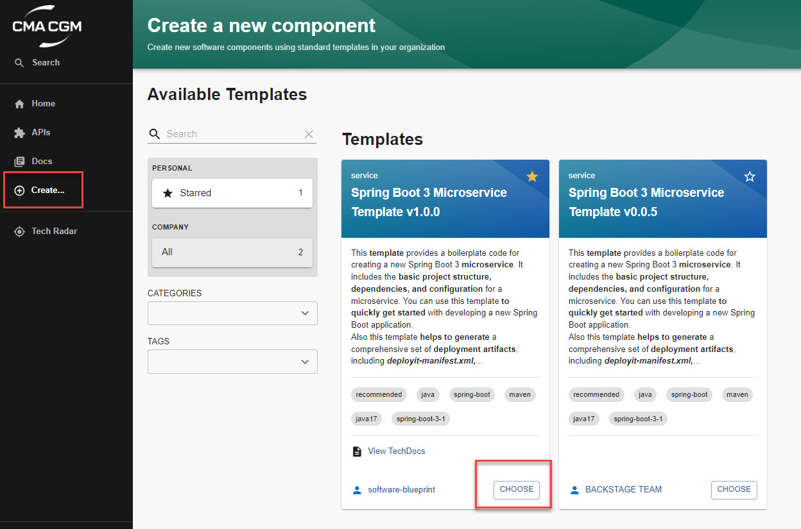
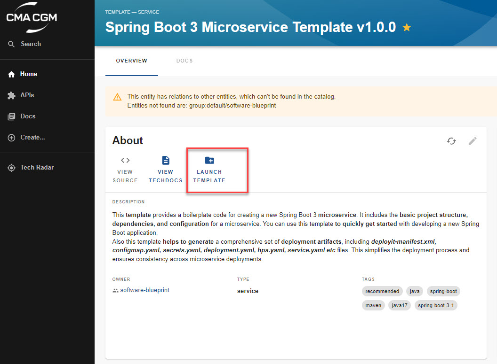
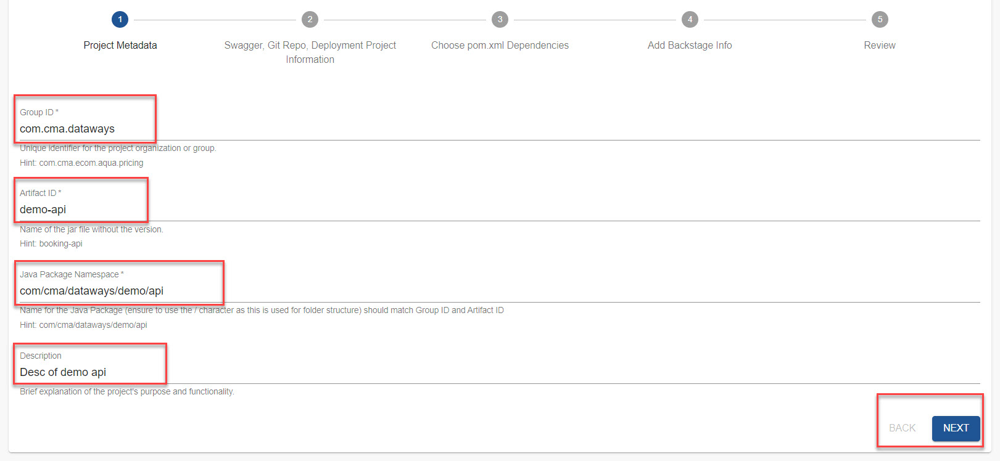
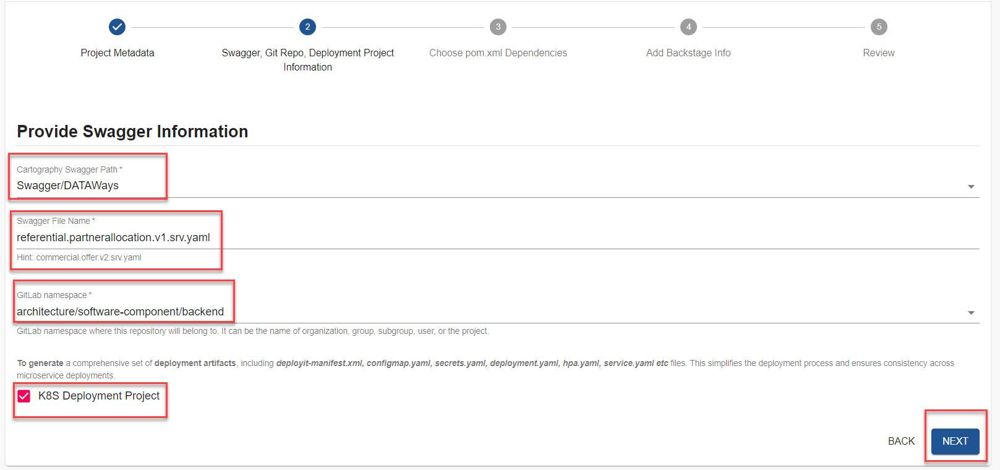
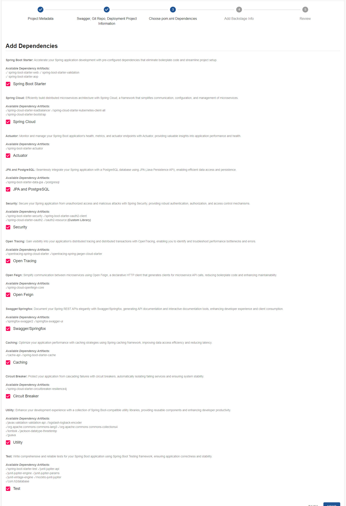
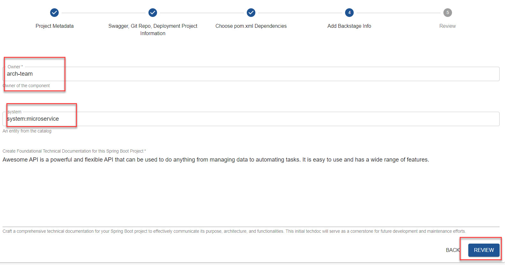
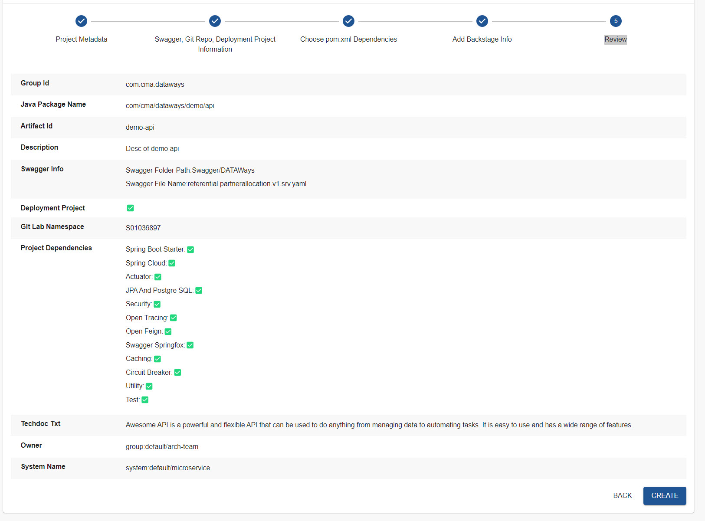
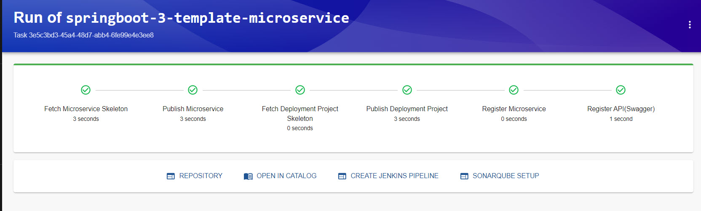

# Introduction

 This __template__ provides a boilerplate code for creating a new Spring Boot 3 __microservice__. 
    It includes the __basic project structure, dependencies, and configuration__ for a 
    microservice. You can use this template __to quickly 
    get started__ with developing a new Spring Boot application. \
    Also this template __helps to generate__ a comprehensive set of __deployment artifacts__, including 
                __*deployit-manifest.xml, configmap.yaml, secrets.yaml, deployment.yaml, hpa.yaml, 
                service.yaml etc*__ files. This simplifies the deployment process and ensures 
                consistency across microservice deployments.

# Creating a Template
- Through the **Create** Section

- Using the **LAUNCH TEMPLATE** Option

**Through the Create Section**

**Using the LAUNCH TEMPLATE Option**

# Step-by-Step Guide to Creating a Template

### Step 1: Project Metadata
- **Group ID** : Provide the unique identifier for the project's Maven group.
- **Artifact ID** : Enter the specific name of the project within its group. This will also be used as the Git repository's name.
- **Java Package Namespace** : Specify the root package for all Java classes within the project.
- **Description:** Briefly describe the project's purpose, functionality, and overall goals.

### Step 2: Swagger Integration, Git Repository, and Deployment Project Information
Choose the path of the cartography project and enter the swagger file name to include it in the pom.xml file. This enables automated API documentation and generation.

**Git Repository:** Select the GitLab lab namespace where the project repository will be created. This ensures proper organization and access control.

**K8s Deployment Project:** If desired, enable the creation of a Kubernetes deployment project within the Git repository. This streamlines the deployment process for the microservice.

### Step 3: Choose pom.xml Dependencies

Add the required dependencies for your microservice, such as libraries, frameworks, and other essential components. This ensures proper functioning and integration with external resources.

### Step 4: Add Backstage Info

Provide relevant information that will be displayed in the Backstage Catalog to easily identify and manage the project. This includes metadata, links, and labels.

### Step 5: Review
Carefully review all the inputs provided throughout the template creation process. Ensure they align with your requirements and specifications and click the **Create** button to finalize the template and generate the corresponding microservice project.

### Step 6: Create
- Navigate to the specified Git repository to ensure the project structure, dependencies, and other configuration settings have been correctly created.
- Access the Backstage Catalog and locate the newly created microservice. Verify that it appears correctly and reflects the specified metadata and descriptions.

